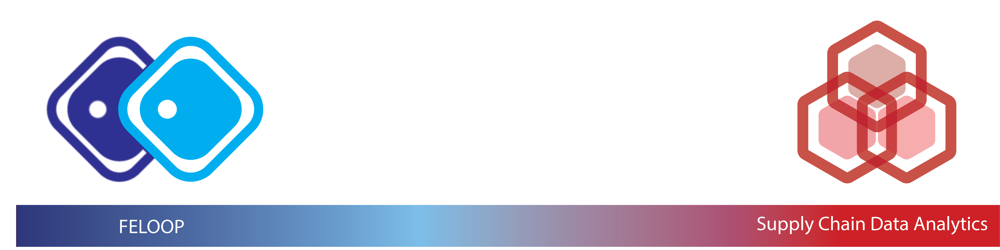

  
  
  

  

<h1 align="center">Official GitHub Profile of Keivan Tafakkori</h1>
<h3 align="center"> Ph.D. Candidate | Industrial Engineering | University of Tehran</h3>

## 📄 Current Projects:

- **PhD Dissertation**

## 📈 Overall Stats:

## 💻 Usage of Programming Languages:

## 🏆 Trophies:

## 📊 Contribution Graph:

## ✍️ Skills:

 
 

 
 </a>
 
<a href="https://www.linux.org/" target="_blank" rel="noreferrer">  
 

 
 </a> <a href="https://scikit-learn.org/" target="_blank" rel="noreferrer"> 

 
 

## 🖇️ Connect wit me:

